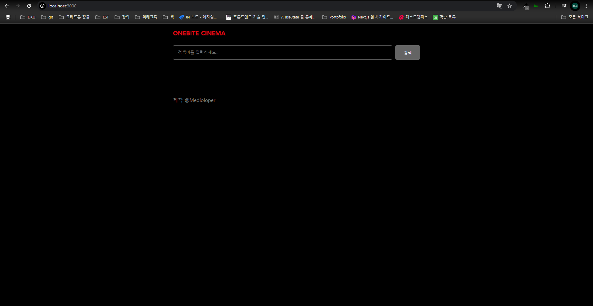
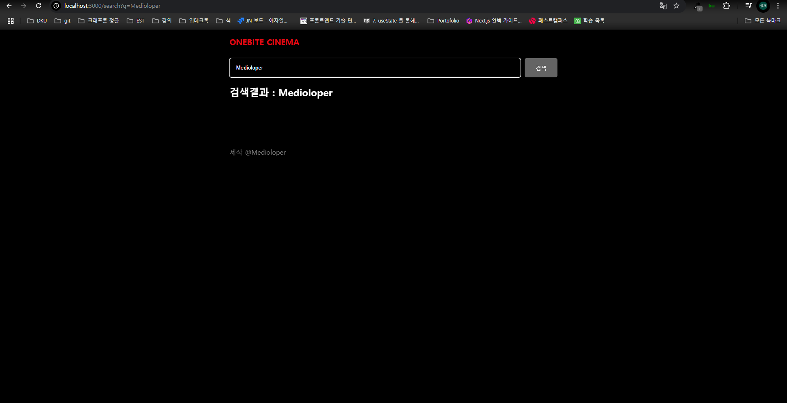
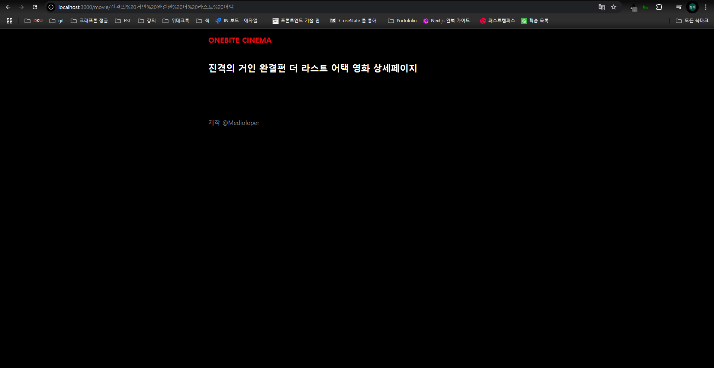

# Day4 Mission
​

다음 조건을 만족하도록 검색바 레이아웃을 설정하세요

​

- 검색바 레이아웃은 "/", "/search" 페이지에만 적용됩니다.

- 위 그림과 같은 검색바가 존재하며 검색 버튼 클릭시 "/search" 페이지로 이동합니다.

   (이때의 검색어는 쿼리스트링 q로 전달됩니다)  

### 1. index page

### 2. index page

### 3. movie page
