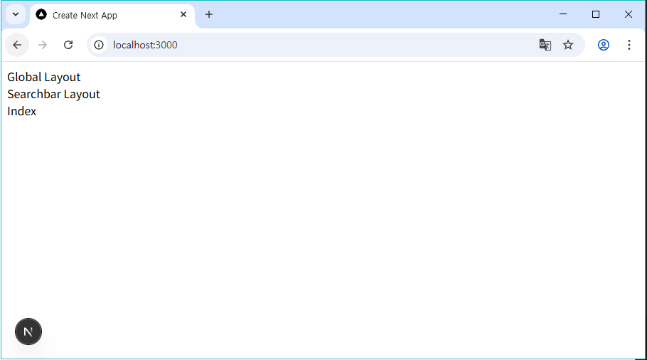

# 1. 프로젝트 생성하기

- App Router를 사용하는 새로운 Next.js 프로젝트를 생성해주세요

- 버전은 현재 보안상 가장 안전한 v15.2.3으로 진행 해 주세요

- 이름은 onebite-cinema-app 또는 자유롭게 설정하시면 됩니다.

* 힌트: npx create-next-app@15.2.3 onebite-cinema-app

​

# 2. 라우팅 설정하기

1. / : 인덱스 페이지

```typescript
export default function Home() {
  return <div className={styles.page}>Index</div>;
}
```

2. /search : 검색 페이지

   - q라는 이름의 쿼리스트링을 전달받아 화면에 렌더링합니다.

```typescript
export default async function Page({
  searchParams,
}: {
  searchParams: Promise<{ q: string }>;
}) {
  const { q } = await searchParams;
  return <div>Search : {q}</div>;
}
```

3. /movie/[id] : 영화 상세 페이지

   - id라는 이름의 URL 파라미터를 화면에 렌더링 합니다.

```typescript
export default async function Page({
  params,
}: {
  params: Promise<{ id: string }>;
}) {
  const { id } = await params;
  return <div>movie: {id}</div>;
}
```

​

# 3. 레이아웃 설정하기 (스타일 및 기능 제외)

​다음 요구사항을 만족하도록 글로벌, 페이지별 레이아웃을 설정해주세요
1. 인덱스, 서치 페이지는 글로벌 레이아웃과 서치바 레이아웃이 중첩 적용됩니다.

2. 무비 페이지는 오직 글로벌 레이아웃만 적용됩니다.
## 인덱스 페이지(~/)


## 서치 페이지 (~/search?q=이정환)


## 무비 페이지 (~/movie/10)
