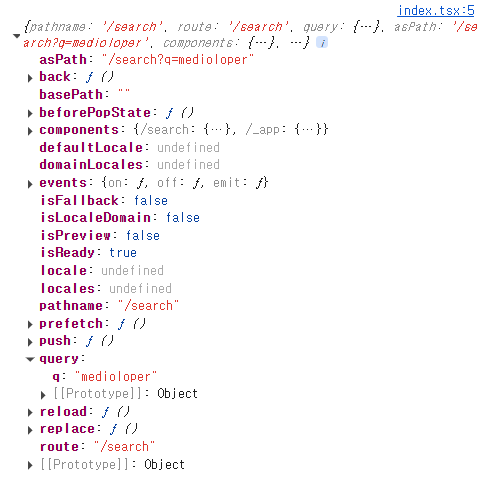
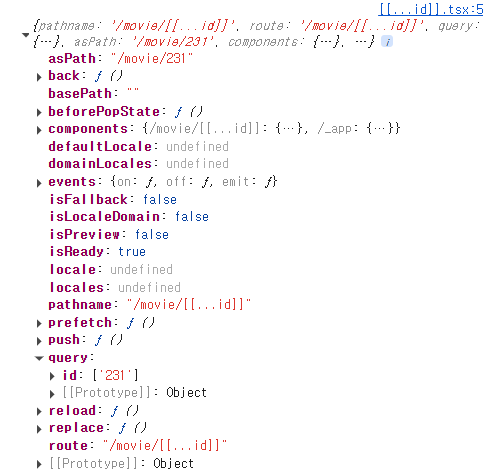
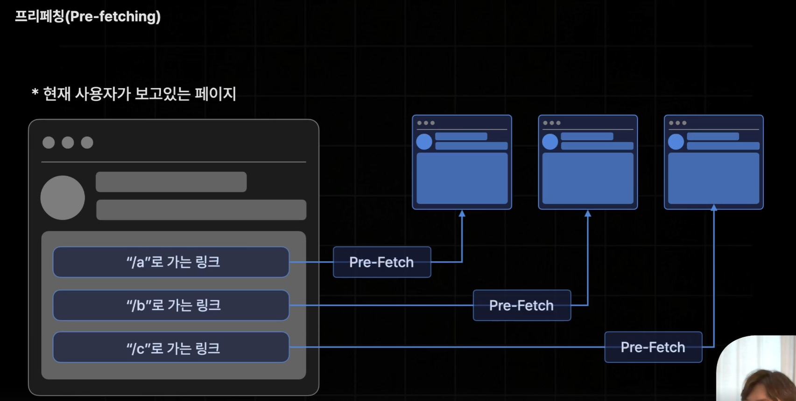

## 이번 시간에 살펴볼 내용

Page Router

Page Router 버전의 Next.js App 만들기

1. Index 페이지
    - 인덱스 경로(/)에 해당하는 페이지
    - 등록된 도서의 리스트를 볼 수 있다
2. Search 페이지
    - 서치 경로(/search)에 해당하는 페이지
    - 제목, 저자 별로 검색 효과를 볼 수 있다
3. Book 페이지
    - /book/{book_id} 경로의 페이지
    - 특정 도서의 상세 정보를 확인할 수 있다

## Page Router

현재 많은 기업에서 사용되고 있는 안정적인 라우터

React Router 처럼 페이지 라우팅 기능을 제공함

Pages 폴더의 구조를 기반으로 페이지 라우팅을 제공함

`npx` : Node Package Executor

`npx create-next-app@14 section02` 

section02라는 이름으로 create-next-app 14버전의 nextjs를 실행(npx)

`import alias`: 절대 경로로 모듈을 import 할 수 있도록 도와주는 기능

→ `import A from @/components/~" (@는 /src 경로를 의미함)

`_app.tsx` `_document.tsx` : page폴더에 있지만 page역할은 아님, next에 공통적으로 적용될 로직이나, 레이아웃, 데이터를 다루기 위해서 필요한 파일

`_app.tsx` 안에 두 가지 props { Component, pageProps }

Component: page역할

## 페이지를 만드는 방법 (2가지)

1. {경로 이름}.tsx 로 생성
2. {경로이름}폴더 생성 `index.tsx` 생성

### 페이지 중첩

- `./{페이지 이름}/{중첩 페이지 이름}`

## 쿼리 스트링 설정

Query String: 페이지 경로에는 영향을 주지 않기 때문에 pages에 특별히 설정할 것 ❌

useRouter을 불러와서 호출

`import { useRouter } from "next/router";`

1. `useRouter` import (페이지 라우터에서는 app/router에 useRouter)
2. router 객체
    
    
    
    query 불러오는 법
    
    `const q = router.query.q || const { q } = router.query` ;
    

## 동적 파라미터 설정

- `./{ 폴더이름 }/[id].tsx`  ⇒ 동적 경로를 갖음
- 파라미터 값 사용
    - 쿼리 스트링과 동일

`const id = router.query.id || const { id } = router.query`

### 중첩된 경로

- `./{ 폴더이름 }/[...id].tsx` ⇒ Catch All Segment(구간)
- ex) [`http://localhost:3000/movie/231/dsbajd/dsabkdsa`](http://localhost:3000/movie/231/dsbajd/dsabkdsa)

### 일반 경로

- [`http://localhost:3000/movie`](http://localhost:3000/movie/231/dsbajd/dsabkdsa) 와 같은 일반 경로는 나타내지 못함
- 해결책: `./{ 폴더이름 }/[[...id]].tsx` ⇒ Optional Catch All Segment

## Not Found 페이지

page폴더 내부에 `404.tsx` 로 지정

# Day3  
## 네비게이팅 (Navigating)
`<Link>` 태그  
`import Link from "next/link;`
`<Link href={"경로"}>index</Link>`  

### Programmatic Navigation
- 사용자가 링크를 직접 클릭했을 때 페이지를 이동시키는 방식❌
- (특정 버튼 클릭 || 특정 조건 만족) 했을 때 함수 내부에서 페이지를 이동시키는 방법

#### router.(push, replace, back)
- 함수 내부에서 페이지를 CSR 방식으로 이동 가능
    - push: 해당 경로 이동
    - replace: 뒤로 가기를 방지 이동
    - back: 페이지 뒤로 이동

## 프리패칭 (Pre-Fetching)
- 페이지를 사전에 불러오는 것
- 현재 사용자가 보고 있는 페이지 내에서 이동할 가능성이 있는 모든 페이지를 사전에 미리 불러오는 기능
- 페이지 패칭을 함으로서 페이지 이동을 빠르게 함

### 프리패치 해제
- `<Link prefetc{false}>` 

## API Routes
- Next.js에서 API를 구축할 수 있게 해주는 기능
- 백엔드 API 서버가 하는 일과 동일하게 간단한 API를 구축, 브라우저로부터 요청을 받아 DB에서 데이터를 꺼내오기 || third-party 데이터를 불러와 전달 하는 기능을 대신 함